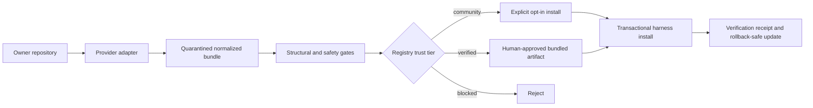

# ADR-001: Immutable source adapters for scalable skill distribution

**Status:** Accepted for V1 implementation
**Date:** 2026-08-09
**Deciders:** OpenKartr maintainers

## Context

OpenKartr needs to make many owner-maintained skills discoverable and
installable without copying thousands of repositories into the OpenKartr
repository or claiming that every indexed skill received a human security
review. The existing npm package safely distributes two reviewed snapshots,
but bundling every future skill would make releases, legal review, and package
size unmanageable.

V1 must work with the existing Node.js CLI, GitHub repositories, npm trusted
publishing, static website catalog, and a small maintainer team. It must not
require a database or a long-running backend.

## Decision

Separate the installer, registry, source adapters, and reviewed artifacts.

- The `openkartr` npm package remains the universal installer.
- A versioned registry contains normalized metadata and immutable source
  descriptors. The registry ships inside npm in V1, so it is covered by npm's
  package integrity and the repository release process.
- Verified skills remain bundled reviewed artifacts.
- Community skills resolve through a provider adapter at one full commit SHA.
  `latest`, branches, and tags are not valid install targets.
- GitHub is the first provider adapter. Additional providers implement the same
  normalized bundle contract later.
- Community content is downloaded into quarantine, constrained and scanned,
  and only then transactionally installed.
- Community and verified are distinct trust tiers in the CLI and website.
- Candidate ingestion creates review data, never a live listing or release.



## Registry contract

Each installable record has a stable slug, description, trust tier, license
signal, compatibility metadata, and source descriptor. GitHub descriptors
contain repository owner, repository name, subtree path, and a full 40-character
commit SHA. A content hash is calculated after download and recorded in the
local installation receipt.

The V1 registry is bundled JSON. A future remote registry must be signed and
support rollback before the CLI trusts it.

## Adapter contract

An adapter receives a validated immutable source descriptor and returns:

```text
NormalizedSkillBundle {
  files: [{ relativePath, bytes }]
  sourceCommit
  contentHash
  scanResult
}
```

Adapters cannot write into agent directories. They may only return a bundle
that passed source-specific retrieval checks. The installer owns quarantine,
policy enforcement, and the final filesystem transaction.

## Safety policy

- Reject mutable source references, redirects outside expected GitHub hosts,
  symlinks, submodules, hidden paths, oversized trees, oversized files, and
  unsupported binary types.
- Require a root `SKILL.md` with valid skill frontmatter.
- Scan text for secrets, credential access, remote shell execution, broad
  destructive actions, and encoded execution.
- V1 community installs reject executable files entirely. Executable skills
  must enter the verified review lane.
- Non-interactive community installs require `--allow-community`. Interactive
  installs require an explicit confirmation after trust and source information
  is displayed.
- Stage every destination before replacing anything. Keep recoverable backups
  until all selected destinations are swapped successfully; roll back on error.
- Never label an automated community scan as human verification.

## Options considered

### Bundle every skill in one npm package

| Dimension | Assessment |
|---|---|
| Complexity | Low initially |
| Cost | Growing npm and review cost |
| Scalability | Poor |
| Security | Strong only if every change is reviewed |

Rejected because unrelated skill updates force monolithic releases and
OpenKartr would become responsible for mirroring every owner.

### Install directly from mutable GitHub branches

| Dimension | Assessment |
|---|---|
| Complexity | Low |
| Cost | Low |
| Scalability | High |
| Security | Unacceptable supply-chain and TOCTOU risk |

Rejected because the content observed by the website, scanner, and installer
could differ.

### Immutable adapter registry with two trust tiers

| Dimension | Assessment |
|---|---|
| Complexity | Medium |
| Cost | Low for V1 |
| Scalability | High |
| Security | Explicit and enforceable trust boundaries |

Accepted. It automates retrieval and routine safety checks while preserving a
meaningful verified tier.

## Architecture review

The proposal was reviewed against integrity, failure recovery, trust semantics,
legal provenance, rate limits, and operational ownership. Four blocking issues
from the initial design were resolved in this ADR:

1. Mutable owner updates are replaced with full commit pins.
2. Direct-to-agent downloads are replaced with quarantine and policy gates.
3. Delete-then-copy updates are replaced with transactional staging and rollback.
4. A scan result is separated from human verification in both data and UX.

Residual risks accepted for V1:

- GitHub availability and unauthenticated API limits affect first-time community
  installs. Existing installed copies remain usable.
- Static registry updates require an npm release.
- Pattern scanning cannot prove natural-language instructions are safe.
- Community license signals may be incomplete; OpenKartr does not redistribute
  those sources as verified artifacts.

## Consequences

- OpenKartr can index many skills while storing only reviewed artifacts.
- Community installs are more capable but carry an explicit owner-source risk.
- Verified releases remain slower because human review is intentional.
- The CLI becomes the policy enforcement point and requires stronger tests.
- Remote registry signing, cached artifacts, revocation checks, and search
  infrastructure must be revisited when the catalog or traffic grows.

## Implementation sequence

1. Add the registry schema and loader.
2. Add the GitHub adapter and quarantined scanner.
3. Add a candidate-ingestion command that emits non-live review records.
4. Integrate trust-aware resolution and transactional installation into the CLI.
5. Add website trust labels and adapter-backed install availability.
6. Add a signed remote registry and artifact cache only after V1 usage warrants it.
