# OpenKartr source and release architecture

## Requirements

- A public source link must lead directly to the repository that supplies the
  installable artifact. An MCP Market page is discovery provenance, never a
  source repository.
- A merged change under `skills/` must become available through the public npm
  package without a manual local publish.
- A user running the canonical command must resolve the npm `latest` release
  and safely refresh an installation previously managed by OpenKartr.
- Unmanaged local folders must not be overwritten silently.

## V1 data flow

```mermaid
flowchart LR
    A["Owner changes tracked upstream path"] --> B["Daily watcher opens review issue"]
    B --> C["Maintainer creates snapshot PR"]
    C --> D["Automated security and integrity gates"]
    D --> E["Human approves exact commit and content hash"]
    E --> F["Merge to main"]
    F --> G["Publish immutable openkartr npm version with OIDC"]
    G --> H["npm latest tag"]
    H --> I["npx --prefer-online openkartr@latest install <slug>"]
    I --> J["Managed skill plus verification receipt"]
```



For verified skills, the npm package is the immutable delivery artifact. For
community skills, npm carries the immutable registry descriptor and installer,
while the adapter retrieves the exact pinned owner commit. The npm `latest`
dist-tag is the registry and installer update pointer. The website is the
discovery and explanation surface.

## Catalog and distribution are separate

The website may contain metadata for many discovered skills, but OpenKartr does
not fork or copy all of their repositories. Entries remain non-installable
references until identity, license, and security checks pass. A published
third-party skill contains only the reviewed skill subtree, not a full upstream
repository clone.

Every packaged skill has an `OPENKARTR.json` trust manifest. It pins the full
upstream commit and path, records the license decision and attribution, declares
permissions, names the reviewer and date, and binds approval to a SHA-256 hash.
CI rejects undeclared executable content and reviewed-content drift.

The scheduled watcher reads upstream metadata and opens a GitHub issue when the
tracked path has a newer commit. It has no permission or code path to modify the
repository or publish npm. See `docs/SECURITY_REVIEW.md` for the human approval
workflow.

## Source-link contract

For a verified skill, the website reads `release.repositoryUrl` as an HTTPS
GitHub URL pointing to the OpenKartr skill folder, for example:

```text
https://github.com/openkartr/skills/tree/main/skills/rca-analysis
```

For a community adapter skill, the source URL points directly to the owner
repository, full pinned commit, and skill path. Third-party discovery pages may
remain under private `provenance` for research auditing, but the public source
button never points to MCP Market or to a mutable branch.

## Release contract

`publish.yml` runs for changes that can alter the npm artifact. It validates
the complete package, explicitly blocks any non-verified manifest, allocates
the next patch version, records that version on `main`, publishes through npm
trusted publishing, and tags the published commit. Releases are serialized to
prevent two pushes from claiming the same version.

Configure the npm package's trusted publisher with:

- Provider: GitHub Actions
- Organization or user: `openkartr`
- Repository: `skills`
- Workflow filename: `publish.yml`
- Allowed action: `npm publish`

No long-lived npm write token is stored in GitHub.

## Installer contract

The canonical command is:

```bash
npx --prefer-online openkartr@latest install <slug>
```

`@latest` avoids accidentally executing an older project-local dependency.
`--prefer-online` forces npm to check registry metadata immediately. The CLI
reads the bundled registry. Verified entries resolve to packaged directories
under `skills/`; community entries resolve through a supported provider adapter
and immutable source descriptor.

Each successful install writes `.openkartr.json`. A repeated install may
replace a folder carrying a matching marker. An unmarked directory is treated
as user-owned and requires `--force` before replacement. The marker is also a
local trust receipt containing package version, source commit, trust tier, scan
or review status, and content hash.

## Why MCP Market links work without a universal npx command

MCP Market is an index. It can derive author, repository, stars, categories,
and documentation from GitHub or submitted metadata. That does not mean the
repository owner published an executable npm package with a `bin` entry and a
cross-harness installer.

Some indexed skills are downloadable files, some belong to plugin repositories,
some use a third-party installer, and some MCP servers have their own package
commands. Discovery metadata and package distribution are separate systems.
OpenKartr deliberately owns both sides for verified OpenKartr releases.

## Failure handling

- Validation failure: nothing is published.
- Upstream change: a review issue is opened; the current approved npm snapshot
  remains unchanged and installable.
- Review-required, rejected, or revoked manifest: package publication is blocked.
- npm authentication failure: the version commit remains visible; rerun the
  workflow after correcting trusted-publisher settings. The next run allocates
  a new patch safely.
- Concurrent pushes: the release concurrency group processes them serially.
- Existing unmanaged installation: installation stops without modifying it.
- Existing managed installation: the newest packaged copy replaces it.

## Trade-offs and future revision

V1 publishes the entire catalog as one npm package, so any skill change creates
a package patch release. This is simple and makes one command work for every
skill, at the cost of a growing download.

Revisit the design when the package becomes large or third-party publishers can
ship independently. At that point split the stable CLI from versioned skill
artifacts, add signed manifests and checksums, and let the CLI download only the
selected reviewed artifact.
